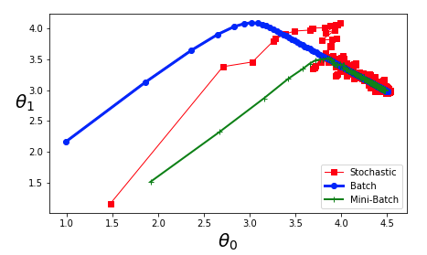
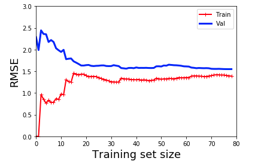

# Deep-Learning-From-Scratch

# 1. Notebook #1

- Linear Layer 
- Weight Decay

# 2. Training Models

- Linear Regression 

  - Batch Gradient Descent 
  - Stochastic Gradient Descent 
  - Min-batch Gradient Descent 

  

- Polynomial Regression

  

- Learning Curves 

  